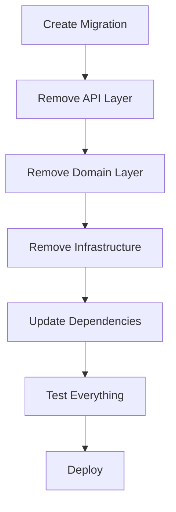

# HappyRobot Subagent 1 - Implementation Planner Summary

## Role
Implementation Planner for HappyRobot FDE Platform

## Task Completed
Created comprehensive implementation plan for REMOVING all calls-related endpoints and infrastructure from the codebase

## Overview of Implementation Plan Created

### Scope
Designed a complete solution for removing the calls functionality including:
- API endpoints (`/api/v1/calls/handoff` and `/api/v1/calls/finalize`)
- Database table and all related infrastructure
- Domain entities, repositories, and all supporting code

### Document Created
`docs/IMPLEMENTATION_PLAN_DELETE_CALLS.md` - A comprehensive 5-phase plan with 15 specific tasks

### Key Components Identified for Removal
1. **API Layer**: 2 endpoints in `calls.py`
2. **Database**: `calls` table with 11 indexes
3. **Domain Layer**: Call entity and enums
4. **Infrastructure**: PostgreSQL repository implementation
5. **Port Interfaces**: ICallRepository interface

## Key Architectural Decisions Made

### 1. Complete Removal Strategy
- **Decision**: Full removal rather than deprecation
- **Rationale**: Avoid technical debt, clean architecture, clear boundaries

### 2. Migration-First Approach
- **Decision**: Create database migration but delay execution
- **Rationale**: Ensures code and schema changes are synchronized

### 3. Phased Implementation
- **Decision**: 5 distinct phases with validation checkpoints
- **Rationale**: Minimizes risk, allows for validation at each step

### 4. Atomic Commits
- **Decision**: Each component removal as separate commit
- **Rationale**: Easier rollback if issues discovered

### 5. Comprehensive Testing
- **Decision**: Full test suite run after each major change
- **Rationale**: Early detection of integration issues

## Agent Assignments and Rationale

### Backend Agent (11 tasks)
**Primary Responsibilities**:
- Database migration creation
- File deletions (calls.py, call.py, call_model.py, call_repository.py)
- Import cleanup across 8+ files
- Update negotiations model and metrics endpoint
- Documentation updates

**Rationale**:
- Deep understanding of codebase structure
- Expertise in Python/FastAPI
- Familiar with Alembic migrations

### QA Agent (3 tasks)
**Primary Responsibilities**:
- Remove call-related tests
- Update integration tests
- Validate system integrity

**Rationale**:
- Testing expertise
- Can identify hidden dependencies
- Ensures no broken functionality remains

### AWS ECS Troubleshooter (1 task)
**Primary Responsibilities**:
- Review infrastructure configuration
- Validate deployment readiness

**Rationale**:
- Infrastructure expertise
- Can identify deployment risks

## Risk Assessments Identified

### Critical Risks
1. **Irreversible Data Loss**
   - Impact: Complete loss of calls table data
   - Mitigation: Mandatory database backup before migration
   - Recovery: Downgrade migration prepared

2. **Breaking API Changes**
   - Impact: External systems calling removed endpoints will fail
   - Mitigation: Consumer notification required (1 week advance)
   - Recovery: Stub endpoints returning HTTP 410 Gone

3. **Cascade Effects**
   - Impact: Negotiations table loses call_id foreign key
   - Mitigation: Thorough testing of negotiation workflows

### Operational Risks
1. **Long Implementation Window** (4.5 hours estimated)
   - Mitigation: Schedule maintenance window

2. **Complex Rollback**
   - Mitigation: Detailed rollback procedures documented

3. **Loss of Metrics**
   - Impact: Dashboards may break
   - Mitigation: Update dashboard configurations simultaneously

## Coordination Strategies Recommended

### Execution Timeline
1. **Phase 1** (30 min): Database migration preparation
2. **Phase 2** (2 hours): Code removal and updates
3. **Phase 3** (30 min): Documentation updates
4. **Phase 4** (1 hour): Testing and validation
5. **Phase 5** (30 min): Deployment preparation

### Critical Dependencies


### Communication Protocol
1. Pre-implementation notification to API consumers
2. Progress updates at each phase completion
3. Post-implementation verification report
4. 24-hour monitoring period

## Implementation Validation Checklist

### Code Validation
- All call-related files deleted
- No import errors (`python -m py_compile`)
- Type checking passes (`mypy .`)
- Linting passes (`ruff check .`)
- All tests pass (`pytest`)

### Database Validation
```sql
-- Verify calls table removed
SELECT * FROM information_schema.tables WHERE table_name = 'calls';
-- Should return 0 rows

-- Verify negotiations updated
SELECT column_name FROM information_schema.columns
WHERE table_name = 'negotiations' AND column_name = 'call_id';
-- Should return 0 rows
```

### API Validation
```bash
# These should return 404
curl -X POST http://localhost:8000/api/v1/calls/handoff
curl -X POST http://localhost:8000/api/v1/calls/finalize

# Metrics should work without call data
curl http://localhost:8000/api/v1/metrics/summary
```

## Alternative Approaches Considered

### Gradual Deprecation (Rejected)
- Add deprecation warnings
- Implement stub endpoints
- Remove over multiple sprints
- **Rejected because**: Clean removal preferred, avoids technical debt

### Feature Flag Approach (Optional)
- Disable endpoints via configuration
- Test in production before removal
- **Status**: Suggested as optional safety measure

## Success Metrics Defined

### Technical Success
- Zero import errors
- All remaining tests pass
- No 500 errors in production
- Database migration completes cleanly

### Business Success
- No disruption to remaining functionality
- Clear communication to stakeholders
- Successful removal within maintenance window

## Recommendations for Implementation

### Critical Actions
1. **Backup database** before any changes
2. **Notify consumers** at least 1 week in advance
3. **Test locally** with full docker-compose stack
4. **Monitor closely** for 24 hours post-deployment

### Safety Measures
1. Keep downgrade migration ready
2. Prepare stub endpoints as backup
3. Document all changes in version control
4. Have rollback plan tested and ready

## Conclusion

The implementation plan provides a systematic, low-risk approach to removing the calls functionality. The hexagonal architecture makes this removal relatively clean with clear boundaries between components. The plan prioritizes:

- **Safety**: Through backups and rollback procedures
- **Communication**: Clear notification to all stakeholders
- **Validation**: Comprehensive testing at each phase
- **Documentation**: Complete audit trail of changes

The estimated 4.5 hour implementation window is realistic given the scope, and the phased approach allows for early detection of any issues. With proper execution, this removal will simplify the codebase while maintaining system stability.
