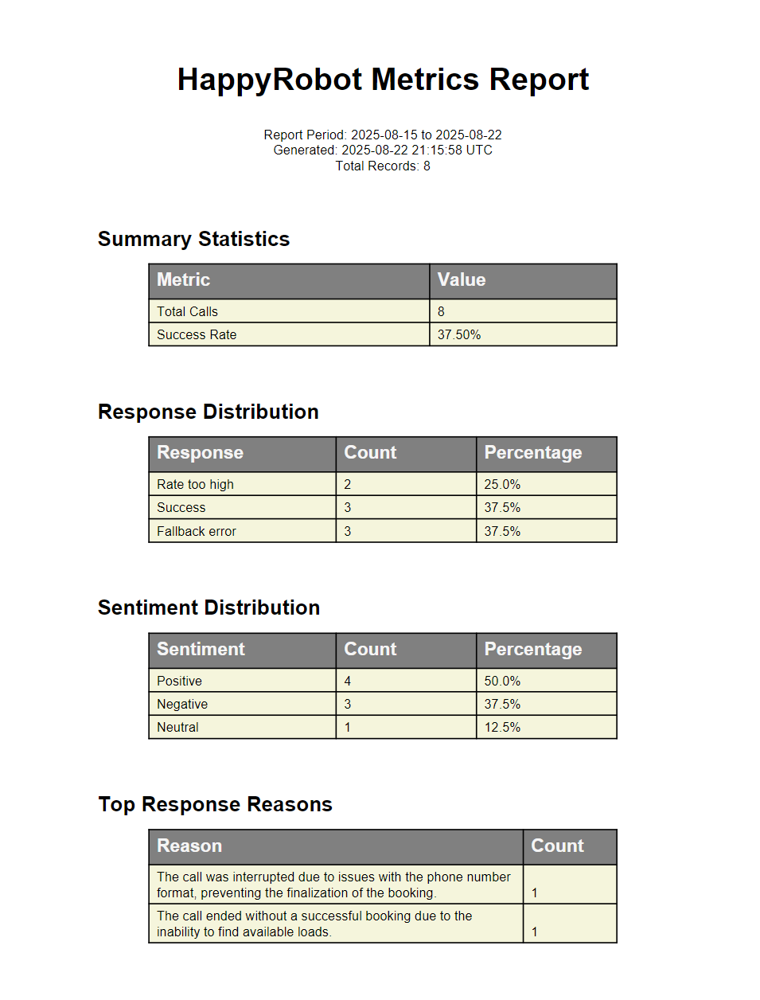

# HappyRobot Metrics CLI Guide

## Overview
The HappyRobot Metrics CLI is a command-line tool for fetching call metrics data and generating reports in PDF or JSON format. It connects to the HappyRobot API to retrieve call analytics, sentiment analysis, and performance metrics.

## Installation

### Prerequisites
- Python 3.12+
- Poetry for dependency management

### Setup with Poetry
```bash
# Install Poetry if not already installed
curl -sSL https://install.python-poetry.org | python3 -

# Install project dependencies
poetry install

# Activate the virtual environment
poetry shell
```

## Usage

### Basic Usage
Generate a PDF report for the last 7 days:
```bash
poetry run python -m src.interfaces.cli --api-key YOUR_API_KEY
```

### Command Options

| Option | Description | Default |
|--------|-------------|---------|
| `--api-url` | API base URL | `http://localhost:8000` |
| `--api-key` | API key for authentication (required) | - |
| `--start-date` | Start date (YYYY-MM-DD format) | 7 days ago |
| `--end-date` | End date (YYYY-MM-DD format) | Today |
| `--output` | Output file name | `metrics_report.pdf` |
| `--format` | Output format (`pdf` or `json`) | `pdf` |
| `--limit` | Maximum number of records to fetch | 1000 |

### Examples

#### Generate PDF Report for Specific Date Range
```bash
poetry run python -m src.interfaces.cli \
  --api-key YOUR_API_KEY \
  --start-date 2024-01-01 \
  --end-date 2024-01-31 \
  --output january_report.pdf
```

#### Export Metrics as JSON
```bash
poetry run python -m src.interfaces.cli \
  --api-key YOUR_API_KEY \
  --format json \
  --output metrics_data.json
```

#### Use with AWS Deployment
```bash
poetry run python -m src.interfaces.cli \
  --api-url https://your-aws-alb-url.com \
  --api-key YOUR_API_KEY \
  --output production_report.pdf
```

#### Fetch Large Dataset
```bash
poetry run python -m src.interfaces.cli \
  --api-key YOUR_API_KEY \
  --limit 5000 \
  --start-date 2024-01-01 \
  --end-date 2024-12-31
```

## Report Contents

### Sample Report Output

*Example PDF report showing metrics visualization with proper text wrapping in tables*

### PDF Report Includes:
- **Summary Statistics**
  - Total calls processed
  - Success rate percentage
  - Period covered

- **Response Distribution**
  - Breakdown of call outcomes (Success, Rate too high, Fallback error, etc.)
  - Count and percentage for each response type

- **Sentiment Analysis**
  - Distribution of call sentiments (Positive, Neutral, Negative)
  - Count and percentage for each sentiment

- **Top Response Reasons**
  - Most common reasons for call outcomes
  - Frequency counts for each reason

- **Top Sentiment Reasons**
  - Most common reasons for sentiment classifications
  - Frequency counts for each reason

- **Detailed Call Metrics**
  - First 50 calls with date, response, sentiment, and reasons
  - Truncated for readability in PDF format

### JSON Output Includes:
- Complete raw metrics data
- All call records (up to limit)
- Full transcript and classification details
- Machine-readable format for further analysis

## Environment Configuration

### Local Development
```bash
# Use default local API
poetry run python -m src.interfaces.cli \
  --api-key dev-local-api-key
```

### Production
```bash
# Set environment variables
export API_URL=https://api.happyrobot.com
export API_KEY=your-production-key

# Run with environment variables
poetry run python -m src.interfaces.cli \
  --api-url $API_URL \
  --api-key $API_KEY
```

## Troubleshooting

### Common Issues

#### Authentication Failed
```
Error: Authentication failed. Please check your API key.
```
**Solution**: Verify your API key is correct and has proper permissions.

#### Connection Error
```
Cannot connect to API at [URL]. Please check the URL and ensure the service is running.
```
**Solution**:
- For local development, ensure Docker services are running: `docker compose up`
- For production, verify the API URL is correct and accessible

#### SSL Certificate Warning (Local Development)
When using self-signed certificates locally, the CLI will bypass SSL verification. This is normal for development but should not be used in production.

#### Phase 2 Endpoints Not Available
```
Warning: Phase 2 endpoints not yet implemented. Using fallback data.
```
This warning appears when metrics endpoints are not yet deployed. The CLI will generate sample data for demonstration purposes.

## Advanced Usage

### Scheduling Reports with Cron
```bash
# Add to crontab for daily reports at 8 AM
0 8 * * * cd /path/to/project && poetry run python -m src.interfaces.cli --api-key YOUR_KEY --output daily_$(date +\%Y\%m\%d).pdf
```

### Batch Processing Multiple Date Ranges
```bash
#!/bin/bash
# Generate monthly reports for the year
for month in {01..12}; do
  poetry run python -m src.interfaces.cli \
    --api-key YOUR_KEY \
    --start-date "2024-${month}-01" \
    --end-date "2024-${month}-31" \
    --output "report_2024_${month}.pdf"
done
```

### Integration with CI/CD
```yaml
# GitHub Actions example
- name: Generate Weekly Metrics Report
  run: |
    poetry install
    poetry run python -m src.interfaces.cli \
      --api-key ${{ secrets.API_KEY }} \
      --api-url ${{ secrets.API_URL }} \
      --output weekly_report.pdf
```

## API Endpoints Used

The CLI interacts with the following API endpoints:
- `GET /api/v1/metrics/call` - Fetch individual call metrics
- `GET /api/v1/metrics/call/summary` - Fetch aggregated summary statistics

Both endpoints require API key authentication via the `X-API-Key` header.

## Support

For issues or questions:
1. Check the API is running and accessible
2. Verify your API key has proper permissions
3. Review error messages for specific issues
4. Consult the main [README.md](README.md) for general setup
5. Check [DEPLOYMENT.md](docs/DEPLOYMENT.md) for infrastructure issues
