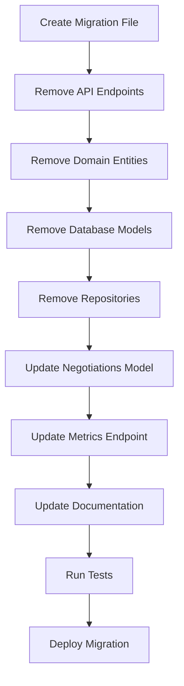

# Implementation Plan: Remove Calls Functionality from HappyRobot FDE

## Executive Summary

This document outlines a comprehensive plan to remove all calls-related functionality from the HappyRobot FDE codebase. The calls feature, which includes endpoints for call handoff and finalization, along with its supporting infrastructure (domain entities, database models, repositories), will be completely removed while maintaining the integrity of the remaining system components.

**Impact Assessment**: This is a BREAKING CHANGE that removes two API endpoints (`/calls/handoff` and `/calls/finalize`) and associated database tables. Dependent systems must be updated before deployment.

## Scope of Changes

### Components to be Removed
1. **API Endpoints**: `/api/v1/calls/handoff` and `/api/v1/calls/finalize`
2. **Database Table**: `calls` table and all related indexes
3. **Domain Layer**: Call entity and related value objects
4. **Infrastructure Layer**: Call repository implementations
5. **Port Interfaces**: Call repository interface

### Components Requiring Modification
1. **Negotiations Model**: Remove foreign key reference to calls table
2. **Metrics Endpoint**: Remove call-related metrics
3. **Database Migration**: Create new migration to drop calls table
4. **API Router**: Remove calls router import and registration
5. **Module Imports**: Clean up all call-related imports

## Detailed Task Breakdown

### Phase 1: Database Schema Changes

#### Task 1.1: Create Database Migration
**Agent**: backend-agent
**Priority**: CRITICAL
**Files to Create**:
- `migrations/versions/002_remove_calls_table.py`

**Actions**:
1. Generate new Alembic migration:
```bash
alembic revision --autogenerate -m "Remove calls table and related infrastructure"
```

2. Migration should include:
```python
def upgrade():
    # Drop foreign key constraints first
    op.drop_constraint('negotiations_call_id_fkey', 'negotiations', type_='foreignkey')

    # Drop indexes
    op.drop_index('ix_calls_external_call_id', 'calls')
    op.drop_index('ix_calls_mc_number', 'calls')
    op.drop_index('ix_calls_carrier_id', 'calls')
    op.drop_index('ix_calls_caller_phone', 'calls')
    op.drop_index('ix_calls_load_id', 'calls')
    op.drop_index('ix_calls_start_time', 'calls')
    op.drop_index('ix_calls_end_time', 'calls')
    op.drop_index('ix_calls_outcome', 'calls')
    op.drop_index('ix_calls_sentiment', 'calls')
    op.drop_index('ix_calls_transferred_to_human', 'calls')
    op.drop_index('ix_calls_follow_up_required', 'calls')

    # Drop the calls table
    op.drop_table('calls')

    # Remove call_id column from negotiations table
    op.drop_column('negotiations', 'call_id')

def downgrade():
    # Re-create calls table and all related infrastructure
    # (reverse of the drop operations)
```

### Phase 2: Backend Code Removal

#### Task 2.1: Remove API Endpoint File
**Agent**: backend-agent
**Files to Delete**:
- `src/interfaces/api/v1/calls.py`

#### Task 2.2: Update API Router
**Agent**: backend-agent
**Files to Modify**:
- `src/interfaces/api/app.py`

**Changes**:
1. Remove import: `from src.interfaces.api.v1 import calls`
2. Remove router registration: `app.include_router(calls.router, prefix="/api/v1")`
3. Remove "Calls" from openapi_tags list

#### Task 2.3: Remove Domain Entity
**Agent**: backend-agent
**Files to Delete**:
- `src/core/domain/entities/call.py`

**Files to Modify**:
- `src/core/domain/entities/__init__.py`
  - Remove all Call-related imports and exports

#### Task 2.4: Remove Database Model
**Agent**: backend-agent
**Files to Delete**:
- `src/infrastructure/database/models/call_model.py`

**Files to Modify**:
- `src/infrastructure/database/models/__init__.py`
  - Remove: `from .call_model import CallModel`

#### Task 2.5: Remove Repository Implementation
**Agent**: backend-agent
**Files to Delete**:
- `src/infrastructure/database/postgres/call_repository.py`

**Files to Modify**:
- `src/infrastructure/database/postgres/__init__.py`
  - Remove: `from .call_repository import PostgresCallRepository`

#### Task 2.6: Remove Repository Port Interface
**Agent**: backend-agent
**Files to Delete**:
- `src/core/ports/repositories/call_repository.py`

**Files to Modify**:
- `src/core/ports/repositories/__init__.py`
  - Remove: `from .call_repository import CallSearchCriteria, ICallRepository`

#### Task 2.7: Update Negotiations Model
**Agent**: backend-agent
**Files to Modify**:
- `src/infrastructure/database/models/negotiation_model.py`
  - Remove import: `from .call_model import CallModel`
  - Remove the call_id field and its foreign key relationship
  - Remove the `call` relationship

#### Task 2.8: Update Metrics Endpoint
**Agent**: backend-agent
**Files to Modify**:
- `src/interfaces/api/v1/metrics.py`

**Changes**:
1. Remove import of PostgresCallRepository
2. Remove call_repo initialization
3. Remove call_metrics_data retrieval
4. Remove all call-related metrics from the response:
   - `call_metrics` object
   - References to `total_calls`
   - Call duration metrics
   - Sentiment analysis from calls
   - Handoff success rates

### Phase 3: Documentation Updates

#### Task 3.1: Update CLAUDE.md
**Agent**: backend-agent
**Files to Modify**:
- `CLAUDE.md`

**Changes**:
1. Remove from "Key API Endpoints" section:
   - `POST /api/v1/calls/handoff`
   - `POST /api/v1/calls/finalize`
2. Remove from "Database Schema" section:
   - `calls` table reference
3. Update "HappyRobot Platform Integration" section to remove references to call handoff and finalization

#### Task 3.2: Update Database Schema Documentation
**Agent**: backend-agent
**Files to Modify**:
- `docs/DATABASE_SCHEMA.md`

**Changes**:
1. Remove entire "Calls Table" section
2. Remove call-related relationships from other tables
3. Remove call-related queries and examples

### Phase 4: Testing and Validation

#### Task 4.1: Remove Call-Related Tests
**Agent**: qa-agent
**Files to Review and Clean**:
- `src/tests/` (search for any call-related test files)

#### Task 4.2: Update Integration Tests
**Agent**: qa-agent
**Actions**:
1. Remove any tests that depend on calls endpoints
2. Update metrics tests to not expect call-related data
3. Update negotiation tests to work without call_id references

#### Task 4.3: Validate System Integrity
**Agent**: qa-agent
**Actions**:
1. Run full test suite: `pytest`
2. Verify all imports are clean: `python -m py_compile src/**/*.py`
3. Type checking: `mypy .`
4. Linting: `ruff check .`

### Phase 5: Deployment Preparation

#### Task 5.1: Update Docker Configuration
**Agent**: backend-agent
**Review Files**:
- `docker-compose.yml`
- `Dockerfile`

**Actions**:
Ensure no references to calls-specific environment variables or configurations

#### Task 5.2: Infrastructure Review
**Agent**: aws-ecs-troubleshooter
**Files to Review**:
- `infrastructure/pulumi/`

**Actions**:
1. Check for any calls-specific infrastructure
2. Ensure database migration will run on deployment
3. Validate ECS task definitions don't reference removed endpoints

## Execution Order and Dependencies



## Risk Assessment

### High Risk Items
1. **Database Migration**: Irreversible data loss of calls table
   - **Mitigation**: Create database backup before migration
   - **Rollback**: Keep downgrade migration ready

2. **Breaking API Changes**: External systems calling removed endpoints will fail
   - **Mitigation**: Notify all consumers before deployment
   - **Rollback**: Can temporarily add stub endpoints returning 410 Gone

### Medium Risk Items
1. **Metrics Dashboard Impact**: Removal of call metrics may break dashboards
   - **Mitigation**: Update dashboard configurations simultaneously

2. **Negotiation Workflow**: Negotiations table loses call_id reference
   - **Mitigation**: Ensure negotiation logic doesn't depend on call_id

## Validation Checklist

- [ ] All call-related files deleted
- [ ] All imports cleaned up (no import errors)
- [ ] Database migration created and tested locally
- [ ] API documentation updated
- [ ] No references to "call" in API router
- [ ] Metrics endpoint returns data without call metrics
- [ ] All tests pass
- [ ] Type checking passes
- [ ] Linting passes
- [ ] Docker compose starts successfully
- [ ] API health check passes

## Post-Deployment Verification

1. **Database Verification**:
```sql
-- Verify calls table is dropped
SELECT * FROM information_schema.tables WHERE table_name = 'calls';
-- Should return 0 rows

-- Verify negotiations table has no call_id column
SELECT column_name FROM information_schema.columns
WHERE table_name = 'negotiations' AND column_name = 'call_id';
-- Should return 0 rows
```

2. **API Verification**:
```bash
# These should return 404
curl -X POST http://localhost:8000/api/v1/calls/handoff
curl -X POST http://localhost:8000/api/v1/calls/finalize

# Metrics should work without call data
curl http://localhost:8000/api/v1/metrics/summary
```

3. **Log Monitoring**:
- Check for any import errors
- Monitor for 404s on old endpoints
- Verify no database connection errors

## Agent Assignments Summary

| Agent | Tasks | Priority |
|-------|-------|----------|
| backend-agent | Tasks 1.1, 2.1-2.8, 3.1-3.2, 5.1 | HIGH |
| qa-agent | Tasks 4.1-4.3 | MEDIUM |
| aws-ecs-troubleshooter | Task 5.2 | LOW |

## Timeline Estimate

- **Phase 1**: 30 minutes (Database migration)
- **Phase 2**: 2 hours (Code removal and updates)
- **Phase 3**: 30 minutes (Documentation)
- **Phase 4**: 1 hour (Testing and validation)
- **Phase 5**: 30 minutes (Deployment prep)

**Total Estimated Time**: 4.5 hours

## Notes for Implementation

1. **IMPORTANT**: Back up the database before running the migration
2. Create the migration file first but don't run it until all code changes are complete
3. Use version control to track all deletions - create atomic commits for each major component removal
4. Consider adding a feature flag to disable calls endpoints before fully removing them
5. Each agent should create their own summary file (`HappyRobot_subagent_X.md`) documenting their specific changes

## Rollback Plan

If issues are discovered post-deployment:

1. **Immediate**: Deploy previous version of application
2. **Database**: Run downgrade migration to restore calls table
3. **API**: Temporarily add stub endpoints that return HTTP 410 Gone with migration notice
4. **Communication**: Notify all API consumers of rollback

---

This plan ensures complete removal of the calls functionality while maintaining system integrity and providing clear rollback procedures if needed.
