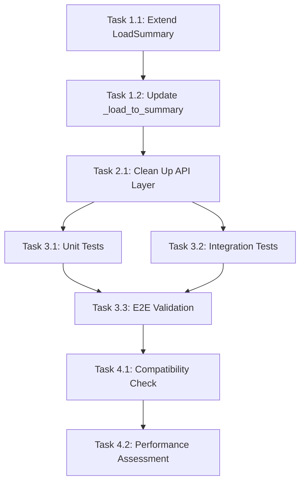

# Implementation Plan: Fix Missing Fields in List Loads Endpoint

## Executive Summary

The `/api/v1/loads/` GET endpoint is not returning three critical fields (`miles`, `num_of_pieces`, and `dimensions`) in the response, while the single load GET endpoint (`/api/v1/loads/{load_id}`) returns them correctly. This issue stems from the `LoadSummary` dataclass in the use case layer missing these fields, causing data loss during the domain-to-API transformation. The fix requires updating the use case layer to include these fields and ensuring proper data flow from the repository through to the API response.

## Root Cause Analysis

### Problem Identification
1. **Location**: The issue occurs in the data transformation pipeline between the use case layer and the API layer.

2. **Specific Issues Found**:
   - The `LoadSummary` dataclass in `list_loads_use_case.py` (lines 39-54) does not include the fields: `miles`, `num_of_pieces`, `dimensions`, and `session_id`
   - The `_load_to_summary` method (lines 144-187) cannot map these fields because they don't exist in the target dataclass
   - The API layer attempts to access these missing fields using `getattr()` with fallback to `None` (lines 312-315), which always returns `None` because the fields don't exist in `LoadSummary`

3. **Why the Single Load Endpoint Works**:
   - The `get_load_by_id` endpoint (lines 340-422) directly accesses the Load entity from the repository
   - It manually constructs the `LoadSummaryModel` with all fields directly from the Load entity (lines 413-416)
   - No intermediate `LoadSummary` dataclass is used, so no data is lost

## Detailed Implementation Plan

### Phase 1: Update Use Case Layer

#### Task 1.1: Extend LoadSummary Dataclass
**Agent**: backend-agent
**File**: `src/core/application/use_cases/list_loads_use_case.py`
**Changes Required**:
```python
@dataclass
class LoadSummary:
    """Load summary for list response."""

    load_id: str
    origin: str
    destination: str
    pickup_datetime: datetime
    delivery_datetime: datetime
    equipment_type: str
    loadboard_rate: float
    notes: Optional[str]
    weight: int
    commodity_type: str
    booked: bool
    created_at: datetime
    # Add missing fields
    dimensions: Optional[str] = None
    num_of_pieces: Optional[int] = None
    miles: Optional[str] = None
    session_id: Optional[str] = None
```

#### Task 1.2: Update _load_to_summary Method
**Agent**: backend-agent
**File**: `src/core/application/use_cases/list_loads_use_case.py`
**Changes Required**:
- Modify the `_load_to_summary` method to include the missing fields in the return statement:
```python
return LoadSummary(
    load_id=str(load.load_id),
    origin=origin_str,
    destination=destination_str,
    pickup_datetime=pickup_datetime,
    delivery_datetime=delivery_datetime,
    equipment_type=equipment_type_name,
    loadboard_rate=loadboard_rate_float,
    notes=load.notes,
    weight=load.weight,
    commodity_type=load.commodity_type or "",
    booked=load.booked,
    created_at=load.created_at,
    # Add missing fields
    dimensions=load.dimensions,
    num_of_pieces=load.num_of_pieces,
    miles=load.miles,
    session_id=load.session_id if hasattr(load, 'session_id') else None,
)
```

### Phase 2: Simplify API Layer

#### Task 2.1: Clean Up LoadSummaryModel Construction
**Agent**: backend-agent
**File**: `src/interfaces/api/v1/loads.py`
**Changes Required**:
- Update lines 298-318 to directly access the fields without `getattr()`:
```python
load_models = [
    LoadSummaryModel(
        load_id=load.load_id,
        origin=load.origin,
        destination=load.destination,
        pickup_datetime=load.pickup_datetime,
        delivery_datetime=load.delivery_datetime,
        equipment_type=load.equipment_type,
        loadboard_rate=load.loadboard_rate,
        notes=load.notes,
        weight=load.weight,
        commodity_type=load.commodity_type,
        booked=load.booked,
        created_at=load.created_at,
        dimensions=load.dimensions,
        num_of_pieces=load.num_of_pieces,
        miles=load.miles,
        session_id=load.session_id,
    )
    for load in response.loads
]
```

### Phase 3: Testing Strategy

#### Task 3.1: Unit Tests for LoadSummary
**Agent**: qa-agent
**File**: `src/tests/unit/core/application/use_cases/test_list_loads_use_case.py`
**Test Coverage**:
- Verify LoadSummary includes all required fields
- Test `_load_to_summary` method maps all fields correctly
- Test with None values for optional fields

#### Task 3.2: Integration Tests for List Loads Endpoint
**Agent**: qa-agent
**File**: `src/tests/integration/api/test_loads.py`
**Test Coverage**:
- Create test loads with all fields populated
- Verify list endpoint returns all fields
- Compare output between list and single get endpoints
- Test pagination doesn't affect field presence

#### Task 3.3: End-to-End Validation
**Agent**: qa-agent
**Test Scenarios**:
1. Create a load with all optional fields via POST
2. Retrieve via list endpoint and verify all fields present
3. Retrieve via single GET and compare responses
4. Test with various combinations of present/absent optional fields

### Phase 4: Deployment Considerations

#### Task 4.1: Backward Compatibility Check
**Agent**: architect-agent
**Considerations**:
- No database migration required (fields already exist)
- API contract maintains backward compatibility (fields are optional)
- Existing clients will receive additional fields but won't break

#### Task 4.2: Performance Impact Assessment
**Agent**: backend-agent
**Considerations**:
- Minimal performance impact (same data retrieved from DB)
- No additional database queries required
- Memory footprint slightly increased due to additional fields in LoadSummary

## Task Dependencies and Execution Order



## Risk Assessment

### Low Risk
- Changes are localized to data transformation layer
- No database schema changes required
- Backward compatible API changes

### Potential Issues
1. **Session ID Field**: The Load entity might not have a `session_id` field by default - need to verify and handle appropriately
2. **Data Type Mismatches**: Ensure field types match between layers (e.g., `miles` is stored as string)

## Success Criteria

1. **Functional Requirements**:
   - List loads endpoint returns `miles`, `num_of_pieces`, and `dimensions` fields
   - Values match those returned by single load GET endpoint
   - Optional fields return `null` when not present

2. **Non-Functional Requirements**:
   - No performance degradation (response time < 200ms for 20 items)
   - All existing tests continue to pass
   - New tests achieve 100% coverage for modified code

## Implementation Timeline

- **Phase 1**: 30 minutes (Use case layer updates)
- **Phase 2**: 15 minutes (API layer cleanup)
- **Phase 3**: 45 minutes (Comprehensive testing)
- **Phase 4**: 15 minutes (Validation and checks)
- **Total Estimated Time**: ~2 hours

## Agent Assignments Summary

1. **backend-agent**:
   - Update LoadSummary dataclass
   - Modify _load_to_summary method
   - Clean up API layer code
   - Assess performance impact

2. **qa-agent**:
   - Create unit tests for LoadSummary
   - Write integration tests for list endpoint
   - Perform end-to-end validation

3. **architect-agent**:
   - Validate backward compatibility
   - Review overall implementation approach

## Notes for Implementing Agents

Each assigned agent should create their own summary file `HappyRobot_subagent_X.md` (where X is their assigned number) documenting:
- Tasks completed
- Any issues encountered
- Test results
- Recommendations for future improvements

## Conclusion

This fix addresses a data loss issue in the transformation pipeline between the domain and API layers. The solution maintains the hexagonal architecture principles while ensuring data integrity throughout the application layers. The implementation is straightforward, low-risk, and maintains full backward compatibility.
